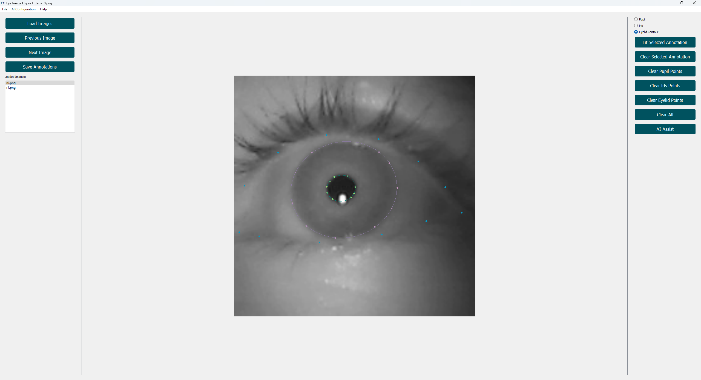

# EyE Annotation Tool

EyE Annotation Tool is a tool for annotating pupil, iris and eyelid in eye images. It provides a user-friendly interface for manual annotation and supports AI-assisted detection.

<p align="center">

</p>

## Features

- Load and navigate through multiple eye images
- Manual annotation of pupil, iris and eyelid
- AI-assisted detection of pupil, iris and eyelid
- Undo functionality for annotations
- Save and load annotations
- Extensible plugin system for custom detectors

## Installation

### Using uv (Recommended)

First, install [uv](https://docs.astral.sh/uv/) if you haven't already:

```bash
curl -LsSf https://astral.sh/uv/install.sh | sh
```

Then install and run the tool:

```bash
# Clone the repository
git clone https://github.com/mh-salari/eye_annotation_tool.git
cd eye_annotation_tool

# Install dependencies
uv sync

# Run the tool
uv run eye_annotation_tool
```

### Using pip (Alternative)

You can also install EyE Annotation Tool using pip:

```bash
pip install eye_annotation_tool
```

Or for the latest development version:

```bash
git clone https://github.com/mh-salari/eye_annotation_tool.git
cd eye_annotation_tool
pip install -e .
```

## Usage

### With uv

```bash
uv run eye_annotation_tool
```

### With pip installation

```bash
eye_annotation_tool
```

Or run it as a module:

```bash
python -m eye_annotation_tool
```

## Adding Custom Plugins

EyE Annotation Tool supports custom plugins for pupil, iris and eyelid detection. To add a new plugin:

1. Create a new Python file in the appropriate plugin directory.
2. Define your detector class in this file.
3. Ensure your detector follows the required interface.

For a detailed guide on creating plugins, see the [Plugin Development Guide](ai/README.md) in the `ai` directory.

## Contributing

Contributions are welcome! Please feel free to submit a Pull Request.

## License

This project is licensed under the MIT License - see the [LICENSE](LICENSE) file for details.

## Acknowledgments

This project has received funding from the European Union's Horizon Europe research and innovation funding program under grant agreement No 101072410, Eyes4ICU project.

<p align="center">

</p>